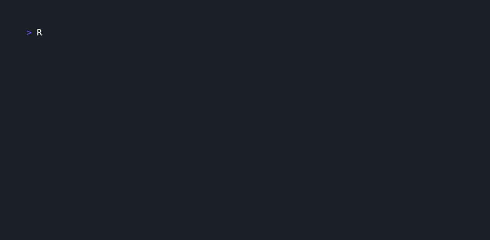

# docling-guard

Catch broken source spans and extraction losses in Docling JSON before they reach a search index.

On the 15 real Docling exports in the Docling project's own test suite,[^real] `docling-guard` passes 12 clean and flags 3 with a provenance span that runs past its source text, all from the same dehyphenation pattern reported in [docling-project/docling#4217](https://github.com/docling-project/docling/issues/4217). The synthetic regression fixture in `docling-guard demo` reproduces one such case in isolation.[^fixture]

[](https://github.com/Arthur031221/docling-guard/actions/workflows/ci.yml) [](LICENSE) [](CHANGELOG.md)



## Why

Document conversion can return a JSON object even when important details are wrong. A [Docling issue](https://github.com/docling-project/docling/issues/4217) reports source spans extending past the extracted text after dehyphenation. Another [report](https://github.com/docling-project/docling/issues/4189) describes text from one table column extending over the next column. A downstream RAG or document pipeline may only notice the damage after indexing.

`docling-guard` checks the exported structure and compares a candidate export with a known baseline. It does not run OCR or load model weights.

## Install

Python 3.10 or newer:

```bash
python3 -m pip install git+https://github.com/Arthur031221/docling-guard.git
```

From a local checkout, run `python3 -m pip install .`.

## Quick start

Create two safe synthetic exports, then compare them:

```bash
ROOT=$(docling-guard demo)
docling-guard check "$ROOT/after.json"
docling-guard compare "$ROOT/before.json" "$ROOT/after.json" --fail-on-drop
```

The first command reports an invalid `charspan`. The second shows the lost text and returns status 2 because the candidate also has a structural error. Both commands are read-only. Use a real Docling JSON export instead of the fixture after you have tried the demo. Docling's current CLI can produce one with `docling convert input.pdf --to json --output ./exports`.

## How it works

`check` validates each text provenance span against its final text length. It checks table-cell grid bounds, grid collisions, and horizontal overlap between single-column cell boxes on the same row. A horizontal overlap is a warning because some layouts may require review rather than automatic rejection.

`compare` reports counts for text items, normalized text characters, tables, and table cells before and after a converter change. It also compares the multiset of exact whitespace-normalized text items. A changed segmentation can appear as removed and added items even when the document meaning is unchanged, so review the samples before treating a diff as a regression.

## Comparison

| Option | What it does | What it does not do |
| --- | --- | --- |
| [Docling JSON export](https://docling-project.github.io/docling/usage/supported_formats/) | Preserves document structure and table spans | Does not compare two exports for this workflow |
| `git diff --no-index` | Shows raw JSON changes | Does not identify invalid spans or summarize extraction loss |
| `docling-guard` | Validates source spans and cell geometry, then summarizes changes | Does not judge semantic OCR accuracy |

## Command reference

```text
docling-guard demo
docling-guard check DOCUMENT.json [--json] [--fail-on-warning]
docling-guard compare BEFORE.json AFTER.json [--json] [--fail-on-drop]
```

`check` exits 0 when no errors are found, 1 for warnings only with `--fail-on-warning`, and 2 for invalid input or structural errors. `compare` exits 0 by default if the candidate has no structural errors, 1 for a detected count decrease with `--fail-on-drop`, and 2 for invalid input or candidate structural errors. `--json` emits a machine-readable report suitable for CI.

## Limits and FAQ

- Inputs must be Docling JSON exports with `texts` and `tables` arrays. Other OCR JSON formats are not accepted in this release.
- A charspan is checked against `orig` when present, since Docling strips enumeration markers like `"b. "` from `text` but keeps them in `orig`. Checking against `text` instead, as version 0.1.0 did, flagged this on most enumerated items in the real-document sample and is why that release was not measured against real exports.
- Each input file is capped at 64 MiB to keep memory use predictable. Larger exports need a streaming reader in a later release.
- A table with more than 2,000 valid cells skips pairwise overlap checks and reports `geometry_skipped`. Bounds are still checked.
- The table-box rule checks horizontal coordinates and may warn on a legitimate unusual layout. It is not proof of extraction failure.
- `compare` does not align pages or match semantically equivalent wording. It catches missing content and exact text changes, not every OCR error.
- This tool never sends document contents to a service. It reads local files only.

## Related projects

- [papercompass](https://github.com/Arthur031221/papercompass): If you feed arXiv PDFs through Docling before indexing them, this checks the export first.
- [receiptwise](https://github.com/Arthur031221/receiptwise): A different local extraction pipeline that a similar regression check could cover.
- [labexplain](https://github.com/Arthur031221/labexplain): Same idea applied to lab reports: extract locally, check the extraction before you trust it.

## Contributing and license

See [CONTRIBUTING.md](CONTRIBUTING.md). MIT, copyright 2026 Arthur.

[^real]: Measured on 2026-10-01 against the 15 JSON files in `docling-project/docling` at commit `d6f03078ad364108df3e7e82e8f0dcc3fd7f39ea`, path `tests/data/pdf/groundtruth/` (arXiv papers, a newspaper interview, a technical handbook, right-to-left documents, and tables). Three of the fixtures are committed in `tests/data/real/` with provenance in `SOURCES.md`; run `scripts/measure_real_documents.sh` to reproduce the full 15-document count. Checking a real document still requires running Docling yourself to produce the JSON; `docling-guard` does not run Docling.

[^fixture]: `docling-guard demo` writes one 19-character baseline text item and a 13-character candidate text item with a `[0, 15]` provenance span. The difference is 6 characters, and the candidate span exceeds the text by 2. Run the commands above to reproduce the results.
