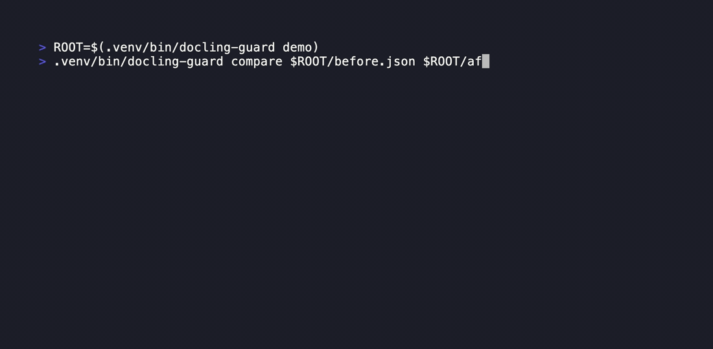

<h1 align="center">
  <br>
  DoclingGuard
</h1>

<p align="center">
  <strong>Check Docling JSON exports for broken source spans and extraction loss before they reach a search index.</strong>
</p>

<p align="center">
  <a href="https://github.com/Arthur031221/DoclingGuard/stargazers"></a>
  <a href="https://github.com/Arthur031221/DoclingGuard/actions"></a>
  <a href="LICENSE"></a>
</p>

<p align="center">
  <a href="#quickstart">⚡ Quickstart</a> •
  <a href="#how-it-works">🔍 How it works</a> •
  <a href="#examples">📖 Examples</a> •
  <a href="#faq">💬 FAQ</a>
</p>

> [!TIP]
> Try the demo without a permanent install:
> ```sh
> uvx --from git+https://github.com/Arthur031221/DoclingGuard.git DoclingGuard demo
> ```

<p align="center">
  
</p>

## Why DoclingGuard

Document conversion can return valid JSON even when important details are wrong. [A Docling issue](https://github.com/docling-project/docling/issues/4217) reports source spans extending past extracted text after dehyphenation. [Another report](https://github.com/docling-project/docling/issues/4189) describes text from one table column extending over the next. A downstream RAG or document pipeline may only notice the damage after indexing.

`docling-guard` checks the exported structure and compares a candidate export with a known baseline. It reads local files and does not run OCR or load model weights.

On the 15 real Docling exports in the Docling project's own test suite, version 0.2.0 passes 12 with zero findings and flags 3 for provenance spans that run past their source text. All three follow the same dehyphenation pattern reported in [docling-project/docling#4217](https://github.com/docling-project/docling/issues/4217). The synthetic demo reproduces one such case. Measurement details are below.

## Features

- 🔎 **Checks provenance ranges:** Each `prov[].charspan` is checked against `orig` when present, or `text` otherwise.
- 🧱 **Checks table structure:** Cell grid bounds and collisions are errors; horizontal overlap between single-column cell boxes on the same row is a warning.
- 📉 **Compares extraction counts:** Reports text items, normalized text characters, tables, and table cells before and after a converter change.
- 🧾 **Finds exact text changes:** Compares the multiset of whitespace-normalized text items and includes removed and added samples.
- 🧰 **Fits CI checks:** `--json` emits a machine-readable report, with opt-in failure modes for warnings and count drops.
- 🔒 **Runs locally:** It reads local JSON files and never sends document contents to a service.

## Quickstart

Python 3.10 or newer is required. Install from Git:

```sh
python3 -m pip install git+https://github.com/Arthur031221/DoclingGuard.git
```

From a local checkout, run:

```sh
python3 -m pip install .
```

Create two safe synthetic exports, then check and compare them:

```sh
ROOT=$(docling-guard demo)
docling-guard check "$ROOT/after.json"
docling-guard compare "$ROOT/before.json" "$ROOT/after.json" --fail-on-drop
```

Output from the check and compare commands:

```text
Text items: 1
Tables: 0
Findings: 1
error invalid_charspan #/texts/0/prov/0: charspan must lie within source text length 13
Before: {'text_items': 1, 'text_chars': 19, 'tables': 0, 'table_cells': 0}
After: {'text_items': 1, 'text_chars': 13, 'tables': 0, 'table_cells': 0}
Drops: {'text_chars': 6}
Removed text items: 1
Added text items: 1
Candidate findings: 1
```

The check and compare commands only read their JSON inputs. The check exits 2 for the invalid span; compare exits 2 because the candidate has a structural error. After trying the fixture, use a real Docling JSON export. Docling's CLI can produce one with `docling convert input.pdf --to json --output ./exports`.

The synthetic fixture has a 19-character baseline item and a 13-character candidate item. Its candidate span is `[0, 15]`, so it extends 2 characters past the candidate text; the text count drops by 6 characters.

## Examples

These outputs use two committed exports from Docling's test suite:

<table>
  <tr>
    <td width="50%" valign="top">
      <b>Clean technical handbook page</b><br>
      <code>DoclingGuard check tests/data/real/amt_handbook_sample.json</code>
      <pre>Text items: 26
Tables: 0
Findings: 0</pre>
    </td>
    <td width="50%" valign="top">
      <b>Newspaper interview with overlong spans</b><br>
      <code>DoclingGuard check tests/data/real/newspaper-00.json</code>
      <pre>Text items: 55
Tables: 0
Findings: 3</pre>
    </td>
  </tr>
</table>

The newspaper export produces three `invalid_charspan` findings from the same dehyphenation pattern.

## How it works

`check` validates each provenance span against the source text length, using `orig` when present and `text` otherwise. It checks table-cell grid bounds and collisions. For single-column cells on the same row, horizontal bounding-box overlap is reported as a warning because some layouts may need review rather than automatic rejection.

`compare` reports counts for text items, normalized text characters, tables, and table cells. It also compares the multiset of exact whitespace-normalized text items. A changed segmentation can appear as removed and added items even when the document meaning is unchanged, so review the samples before treating a diff as a regression.

### Comparison

| Tool | What it does | Where DoclingGuard differs |
| --- | --- | --- |
| [Docling JSON export](https://docling-project.github.io/docling/usage/supported_formats/) | Preserves document structure and table spans | Does not compare two exports for this workflow |
| `git diff --no-index` | Shows raw JSON changes | Does not identify invalid spans or summarize extraction loss |
| `docling-guard` | Validates source spans and cell geometry, then summarizes changes | Does not judge semantic OCR accuracy |

<details>
<summary><b>CLI reference, output, and exit codes</b></summary>

```text
docling-guard demo
docling-guard check DOCUMENT.json [--json] [--fail-on-warning]
docling-guard compare BEFORE.json AFTER.json [--json] [--fail-on-drop]
```

`check` exits 0 when no errors are found, 1 for warnings only with `--fail-on-warning`, and 2 for invalid input or structural errors. `compare` exits 0 by default if the candidate has no structural errors, 1 for a detected count decrease with `--fail-on-drop`, and 2 for invalid input or candidate structural errors. `--json` emits a machine-readable report suitable for CI.

</details>

<details>
<summary><b>Real-document measurement</b></summary>

The 0.2.0 measurement ran on 2026-10-01 against the 15 JSON files in `docling-project/docling` at commit `d6f03078ad364108df3e7e82e8f0dcc3fd7f39ea`, under `tests/data/pdf/groundtruth/`. The set includes arXiv papers, a newspaper interview, a technical handbook, right-to-left documents, and tables. Twelve documents passed with zero findings; three had spans that exceeded their source text, all matching the dehyphenation issue. See the [0.2.0 changelog](CHANGELOG.md).

Three fixtures from that set are committed in `tests/data/real/`, with provenance in `SOURCES.md`. Reproduce the full measurement with:

```sh
scripts/measure_real_documents.sh
```

The script reports `12 of 15 documents passed with zero findings`. Checking a real document still requires running Docling to produce its JSON; `docling-guard` does not run Docling.

</details>

## FAQ

<details>
<summary><b>Which JSON formats are accepted?</b></summary>

Inputs must be Docling JSON exports with `texts` and `tables` arrays. Other OCR JSON formats are not accepted in this release.

</details>

<details>
<summary><b>Why does a charspan use <code>orig</code> when it is present?</b></summary>

Docling can strip enumeration markers such as `"b. "` from `text` while keeping them in `orig`. Version 0.1.0 checked against `text` instead, which flagged most enumerated items in the real-document sample as false positives; that is why 0.1.0 was not measured against real exports.

</details>

<details>
<summary><b>What are the input and geometry limits?</b></summary>

Each input file is capped at 64 MiB to keep memory use predictable. Larger exports need a streaming reader in a later release. A table with more than 2,000 valid cells skips pairwise overlap checks and reports `geometry_skipped`; cell bounds are still checked.

</details>

<details>
<summary><b>Does a table-box warning prove extraction failed?</b></summary>

No. The rule checks horizontal coordinates and may warn on a legitimate unusual layout. It is not proof of extraction failure.

</details>

<details>
<summary><b>Does compare detect every OCR error?</b></summary>

No. It does not align pages or match semantically equivalent wording. It catches missing content and exact text changes, not every OCR error.

</details>

<details>
<summary><b>Does DoclingGuard run OCR or send documents to a service?</b></summary>

No. It reads local files only, does not run OCR or load model weights, and never sends document contents to a service.

</details>

<details>
<summary><b>Which related projects are available?</b></summary>

- [papercompass](https://github.com/Arthur031221/papercompass): If you feed arXiv PDFs through Docling before indexing them, this checks the export first.
- [receiptwise](https://github.com/Arthur031221/receiptwise): A different local extraction pipeline that a similar regression check could cover.
- [labexplain](https://github.com/Arthur031221/labexplain): The same idea applied to lab reports: extract locally, check the extraction before you trust it.

</details>

## Contributing

Open an [issue](https://github.com/Arthur031221/DoclingGuard/issues) with a minimal, redacted Docling JSON fixture before adding a rule. See [CONTRIBUTING.md](CONTRIBUTING.md) for guidance on offline checks and potential false positives.

## License

MIT, copyright 2026 Arthur.

Assisted by Claude/Codex.
